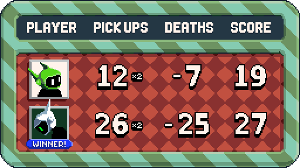

I've mostly been focusing on building out the tooling and engine for Franic, but the game needs graphics too. I'm not an artist, which also makes this more challenging.

I first mocked out the end of round modal as a first stab at some possible graphic styles

I heavily borrowed this style from Gunbarich

I'm pretty happy with it, and I think it sets the stage for pretty good graphics that I'm capable of creating, as well as allows me to narrow my exploration down when doing the rest of the graphics.

From there I whipped up the title screen

Which I'm also pretty happy with.

## In game graphics

I have the first level well under way, so now I am exploring actual in game graphics. Franic doesn't have much of a story, but I did decide the premise is it takes place in a virtual environment. That concept shows itself a little bit such as when the player spawns, and other hints will be added to show this is all a virtual place.

What I like about that is I can make each level have its own theme. For the first level I decided it will take place way up high on a skyscraper construction project, kinda similar to that [one stage in Kizuna Encounter](https://www.fgbg.art/game:kizuna-encounter/skyscraper-construction).

## Looking for a pixel artist

For now I'm going to keep going making the graphics myself. I want to get better at this and the best way to do that is to keep making a lot of graphics.

But I'd love for Franic to be truly top notch too. So if you find the game interesting and are a pixel artist, [let me know](mailto:matt.e.greer@gmail.com) if you want to help. We can talk about payment and all that good stuff too.
